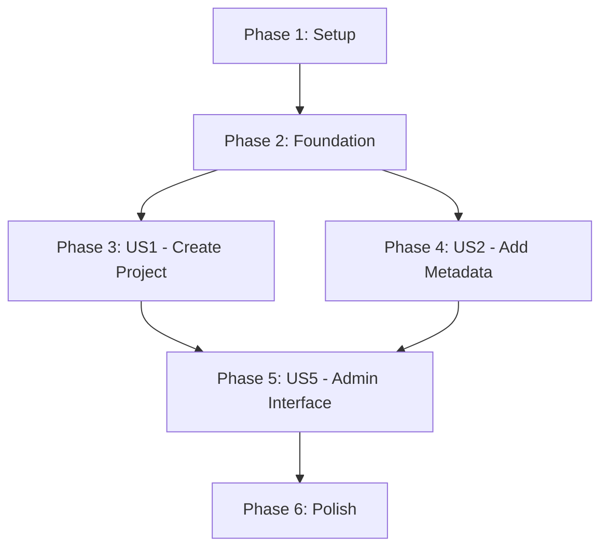

# Tasks: Core Projects MVP

**Branch**: `005-core-projects`
**Date**: January 14, 2026
**Input**: Design documents from `/specs/005-core-projects/`

**Organization**: Tasks are grouped by user story to enable independent implementation and testing of each story.

**Format**: `- [ ] [ID] [P?] [Story] Description with file path`

- **[P]**: Can run in parallel (different files, no dependencies)
- **[Story]**: User story label (US1, US2, US3, US4, US5, US6)

---

## Phase 1: Setup (Shared Infrastructure)

**Purpose**: Project initialization and environment setup

- [X] T001 Create feature branch `005-core-projects` from main
- [X] T002 [P] Verify all dependencies installed (django-guardian, django-tables2, django-filter, django-crispy-forms, django-cotton, DRF)
- [X] T003 [P] Review existing Project model structure in fairdm/core/project/models.py
- [X] T004 [P] Review existing admin configuration in fairdm/core/project/admin.py

---

## Phase 2: Foundational (Blocking Prerequisites)

**Purpose**: Core infrastructure that MUST be complete before ANY user story can be implemented

**⚠️ CRITICAL**: No user story work can begin until this phase is complete

- [X] T005 Add custom permissions to Project model Meta in fairdm/core/project/models.py
- [X] T006 Add unique_together constraint to ProjectDescription Meta in fairdm/core/project/models.py
- [X] T007 Add clean() validation method to ProjectDescription in fairdm/core/project/models.py
- [X] T008 Add clean() validation method to ProjectDate for date range validation in fairdm/core/project/models.py
- [X] T009 Update all model field help_text and verbose_name for i18n in fairdm/core/project/models.py
- [X] T010 Add QuerySet methods (with_metadata, with_list_data) to Project model in fairdm/core/project/models.py
- [X] T011 Create and apply database migrations for model changes
- [X] T012 Update test factories in fairdm_demo/factories.py to use DataCite funding schema
- [X] T013 Add pre_delete signal to prevent project deletion when datasets exist in fairdm/core/project/models.py or receivers.py

**Checkpoint**: Foundation ready - user story implementation can now begin in parallel

---

## Phase 3: User Story 1 - Create and Configure Project (Priority: P1) 🎯 MVP

**Goal**: Enable users to create new projects with streamlined form (minimal fields) and add metadata through edit interface

**Independent Test**: Navigate to project creation page, fill required fields (name, status, visibility), save project, verify redirect to detail page, access edit interface to add additional metadata

### Unit Tests for User Story 1

> **Write these tests FIRST, ensure they FAIL before implementation**

- [X] T014 [P] [US1] Write test_project_creation_with_required_fields in tests/unit/core/project/test_models.py
- [X] T015 [P] [US1] Write test_project_uuid_is_unique in tests/unit/core/project/test_models.py
- [X] T016 [P] [US1] Write test_project_status_choices in tests/unit/core/project/test_models.py
- [X] T017 [P] [US1] Write test_project_visibility_choices in tests/unit/core/project/test_models.py
- [X] T018 [P] [US1] Write test_cannot_delete_project_with_datasets in tests/unit/core/project/test_models.py
- [X] T019 [P] [US1] Write test_create_form_valid_with_required_fields in tests/unit/core/project/test_forms.py
- [X] T020 [P] [US1] Write test_create_form_invalid_without_name in tests/unit/core/project/test_forms.py
- [X] T021 [P] [US1] Write test_edit_form_cannot_set_public_for_concept in tests/unit/core/project/test_forms.py

### Integration Tests for User Story 1

- [X] T022 [P] [US1] Write test_authenticated_user_can_access_create_view in tests/integration/core/project/test_views.py
- [X] T023 [P] [US1] Write test_create_project_redirects_to_detail in tests/integration/core/project/test_views.py
- [X] T024 [P] [US1] Write test_anonymous_user_redirects_to_login in tests/integration/core/project/test_views.py
- [X] T025 [P] [US1] Write test_creator_gets_full_permissions in tests/integration/core/project/test_permissions.py

### Contract Tests for User Story 1

- [X] T026 [P] [US1] Write test_complete_project_creation_flow in tests/contract/core/project/test_creation.py
- [X] T027 [P] [US1] Write test_validation_errors_displayed_inline in tests/contract/core/project/test_creation.py

### Implementation for User Story 1

- [X] T028 [US1] Run unit tests to verify they FAIL (Red phase)
- [X] T029 [P] [US1] Create ProjectCreateForm in fairdm/core/project/forms.py
- [X] T030 [P] [US1] Create ProjectEditForm in fairdm/core/project/forms.py
- [X] T031 [US1] Implement ProjectCreateView with permission assignment in fairdm/core/project/views.py
- [X] T032 [US1] Implement ProjectUpdateView with permission checks in fairdm/core/project/views.py
- [X] T033 [US1] Implement ProjectDetailView with visibility logic in fairdm/core/project/views.py
- [X] T034 [US1] Add URL patterns for create/edit/detail in fairdm/core/project/urls.py
- [X] T035 [P] [US1] Create project_form.html template with crispy-forms layout in fairdm/core/project/templates/project/
- [X] T036 [P] [US1] Create project_detail.html template with metadata tabs in fairdm/core/project/templates/project/
- [X] T037 [US1] Run unit tests to verify they PASS (Green phase)
- [X] T038 [US1] Run integration tests to verify create/edit workflow
- [X] T039 [US1] Run contract tests with pytest-playwright
- [X] T040 [US1] Refactor forms/views for DRY (Refactor phase)

**Checkpoint**: User Story 1 complete and independently testable

---

## Phase 4: User Story 2 - Add Rich Descriptive Metadata (Priority: P1) 🎯 MVP

**Goal**: Enable users to add detailed metadata (descriptions, dates, identifiers) to projects

**Independent Test**: Create project, add multiple descriptions (Abstract, Methods), add date ranges (start/end), add identifiers (DOI, grant number), verify display on detail page

### Unit Tests for User Story 2

- [X] T041 [P] [US2] Write test_duplicate_description_type_raises_validation_error in tests/unit/core/project/test_models.py
- [X] T042 [P] [US2] Write test_end_date_before_start_date_raises_error in tests/unit/core/project/test_models.py
- [X] T043 [P] [US2] Write test_description_form_enforces_uniqueness in tests/unit/core/project/test_forms.py
- [X] T044 [P] [US2] Write test_date_form_validates_range in tests/unit/core/project/test_forms.py
- [X] T045 [P] [US2] Write test_identifier_form_accepts_valid_data in tests/unit/core/project/test_forms.py

### Integration Tests for User Story 2

- [X] T046 [P] [US2] Write test_add_multiple_descriptions_to_project in tests/integration/core/project/test_metadata.py
- [X] T047 [P] [US2] Write test_add_date_range_to_project in tests/integration/core/project/test_metadata.py
- [X] T048 [P] [US2] Write test_add_identifiers_to_project in tests/integration/core/project/test_metadata.py
- [X] T049 [P] [US2] Write test_metadata_displays_on_detail_page in tests/integration/core/project/test_views.py

### Contract Tests for User Story 2

- [X] T050 [P] [US2] Write test_add_metadata_workflow in tests/contract/core/project/test_metadata.py
- [X] T051 [P] [US2] Write test_date_validation_prevents_invalid_ranges in tests/contract/core/project/test_metadata.py

### Implementation for User Story 2

- [X] T052 [US2] Run unit tests to verify they FAIL
- [X] T053 [P] [US2] Create ProjectDescriptionForm in fairdm/core/project/forms.py
- [X] T054 [P] [US2] Create ProjectDateForm in fairdm/core/project/forms.py
- [X] T055 [P] [US2] Create ProjectIdentifierForm in fairdm/core/project/forms.py
- [X] T056 [US2] Update ProjectAdmin with inline formsets in fairdm/core/project/admin.py
- [X] T057 [P] [US2] Create project_metadata.html Cotton component in fairdm/core/project/templates/project/components/
- [X] T058 [P] [US2] Create metadata display sections in project_detail.html template
- [X] T059 [US2] Add HTMX-powered inline editing for metadata in project_detail.html
- [X] T060 [US2] Run unit tests to verify they PASS
- [X] T061 [US2] Run integration tests for metadata workflows
- [X] T062 [US2] Run contract tests with playwright
- [X] T063 [US2] Refactor inline formsets for reusability

**Checkpoint**: User Story 2 complete and independently testable

---

## Phase 5: User Story 5 - Configure Admin Interface (Priority: P3)

**Goal**: Provide comprehensive Django admin interface with bulk operations and advanced features

**Independent Test**: Login as admin, search projects by name/UUID, use filters, edit inline metadata, perform bulk status changes

### Unit Tests for User Story 5

- [X] T064 [P] [US5] Write test_admin_search_fields in tests/unit/core/project/test_admin.py
- [X] T065 [P] [US5] Write test_admin_list_filters in tests/unit/core/project/test_admin.py
- [X] T066 [P] [US5] Write test_admin_bulk_actions in tests/unit/core/project/test_admin.py

### Integration Tests for User Story 5

- [X] T067 [P] [US5] Write test_admin_search_by_name in tests/integration/core/project/test_admin.py
- [X] T068 [P] [US5] Write test_admin_filter_by_status in tests/integration/core/project/test_admin.py
- [X] T069 [P] [US5] Write test_admin_inline_editing in tests/integration/core/project/test_admin.py
- [X] T070 [P] [US5] Write test_admin_bulk_status_change in tests/integration/core/project/test_admin.py

### Contract Tests for User Story 5

- [X] T071 [P] [US5] Write test_admin_search_workflow in tests/contract/core/project/test_admin.py
- [X] T072 [P] [US5] Write test_admin_bulk_operations in tests/contract/core/project/test_admin.py

### Implementation for User Story 5

- [X] T073 [US5] Run unit tests to verify they FAIL
- [X] T074 [US5] Update ProjectAdmin with enhanced configuration in fairdm/core/project/admin.py
- [X] T075 [US5] Add search_fields for name, UUID, owner in ProjectAdmin
- [X] T076 [US5] Add list_filter for status, visibility, added in ProjectAdmin
- [X] T077 [US5] Configure fieldsets with collapsible sections in ProjectAdmin
- [X] T078 [US5] Add bulk action for status changes in ProjectAdmin
- [X] T079 [US5] Add bulk export action (JSON, DataCite) in ProjectAdmin
- [X] T080 [US5] Run unit tests to verify they PASS
- [X] T081 [US5] Run integration tests for admin workflows
- [X] T082 [US5] Run contract tests with playwright

**Checkpoint**: User Story 5 complete and independently testable

---

## Phase 6: Polish & Cross-Cutting Concerns

**Purpose**: Final polish, documentation updates, demo app synchronization

- [X] T083 Run full test suite to verify no regressions
- [X] T084 Verify all user-facing strings use i18n (_() wrapper)
- [X] T085 Update developer guide with Project model patterns in docs/developer-guide/models/
- [X] T086 Update admin guide with new admin features in docs/admin-guide/projects/
- [X] T087 Update contributor guide with project creation workflow in docs/contributor-guide/projects/
- [X] T088 [P] Update fairdm_demo models with comprehensive docstrings
- [X] T089 [P] Link demo code to documentation sections
- [X] T090 [P] Create demo data fixtures with example projects
- [X] T091 Verify ChromeDevTools rendering of all templates at mobile (375px), tablet (768px), desktop (1200px) breakpoints
- [X] T092 Run accessibility audit on project views
- [X] T093 Run performance tests (detail <5 queries, basic list load <1s)
- [X] T094 Generate test coverage report (target: >90% for core functionality)
- [X] T095 Update CHANGELOG.md with feature summary
- [ ] T096 Create pull request with all tests passing
- [ ] T097 Request code review focusing on constitution alignment

---

## Task Dependencies (Story Completion Order)

### Critical Path (MVP)

**Minimum Viable Product** = Phase 1 + Phase 2 + Phase 3 (US1) + Phase 4 (US2)

This delivers:

- ✅ Project creation with streamlined form
- ✅ Project editing with comprehensive metadata
- ✅ Rich descriptive metadata (descriptions, dates, identifiers)
- ✅ Role-based permissions
- ✅ Basic detail and list views

---

## Parallel Execution Opportunities

### User Story 1 Parallelization

**After T026 (tests written), can run in parallel**:

- Group A: T027 (ProjectCreateForm) + T033 (project_form.html)
- Group B: T028 (ProjectEditForm)
- Group C: T029 (ProjectCreateView) + T030 (ProjectUpdateView) + T031 (ProjectDetailView)
- Group D: T034 (project_detail.html)

**After T035 (tests pass)**: T036, T037, T038 run sequentially

### User Story 2 Parallelization

**After T050 (tests written), can run in parallel**:

- Group A: T051 (ProjectDescriptionForm)
- Group B: T052 (ProjectDateForm)
- Group C: T053 (ProjectIdentifierForm)
- Group D: T055 (project_metadata.html component) + T056 (metadata sections)

**Then sequential**: T054 (admin inlines) → T057 (HTMX) → T058-T061 (testing)

### User Story 5 Parallelization

**All admin configuration tasks (T074-T079) can run in parallel** after T073 (tests written)

### Polish Phase Parallelization

**After US5 complete, can run in parallel**:

- Group A: T088 (demo docstrings) + T089 (demo links) + T090 (demo fixtures)
- Group B: T085 (developer guide) + T086 (admin guide) + T087 (contributor guide)
- Group C: T091 (responsive testing) + T092 (accessibility audit)

---

## Implementation Strategy

### MVP-First Approach

1. **Week 1**: Complete Phase 1 (Setup) + Phase 2 (Foundation) + Phase 3 (US1)
   - Deliverable: Users can create and edit projects with basic metadata

2. **Week 2**: Complete Phase 4 (US2)
   - Deliverable: Users can add rich metadata (descriptions, dates, identifiers)

3. **Week 3**: Complete Phase 5 (US5)
   - Deliverable: Enhanced admin interface with search, filters, and bulk operations

4. **Week 4**: Complete Phase 6 (Polish)
   - Deliverable: Production-ready core projects feature with documentation

### Incremental Delivery

Each user story phase produces a **shippable increment**:

- After Phase 3: Basic CRUD operations work
- After Phase 4: Metadata management works (MVP Complete)
- After Phase 5: Enhanced admin interface for portal administrators
- After Phase 6: Production-ready with full documentation and demo data

---

## Total Task Count

- **Setup**: 4 tasks
- **Foundation**: 9 tasks (includes FR-021 deletion prevention)
- **User Story 1** (P1): 27 tasks (14 tests + 13 implementation)
- **User Story 2** (P1): 23 tasks (11 tests + 12 implementation)
- **User Story 5** (P3): 19 tasks (10 tests + 9 implementation)
- **Polish**: 15 tasks

**Total**: 97 tasks

**MVP Scope** (Phases 1-4): 63 tasks (Setup + Foundation + US1 + US2)
**Complete Scope** (Phases 1-6): 97 tasks (MVP + Admin + Polish)

**Deferred to Separate Specs**:

- User Story 3 (Manage Contributors): ~17 tasks - moved to future spec
- User Story 4 (Keywords/Tags): ~16 tasks - moved to future spec
- User Story 6 (Filter/Search/List Views): ~23 tasks - moved to separate list views spec
- REST API: ~21 tasks - moved to future API spec

---

## Validation Checklist

✅ All tasks follow checklist format (`- [ ] [ID] [P?] [Story] Description`)
✅ All tasks include exact file paths
✅ Tasks organized by user story for independent implementation
✅ Each user story has independent test criteria
✅ Tests marked as optional (write tests first per TDD)
✅ Parallel opportunities identified with [P] marker
✅ Dependencies documented in completion order diagram
✅ MVP scope clearly defined (US1 + US2)
✅ Incremental delivery strategy documented
✅ Total task count provided (97 tasks)
✅ Deferred user stories documented (US3, US4, US6, API moved to separate specs)
✅ Focused scope: Core CRUD, Metadata, Admin Interface, and Polish

---

**Status**: Ready for implementation
**Next Action**: Begin Phase 1 (Setup) tasks T001-T004
