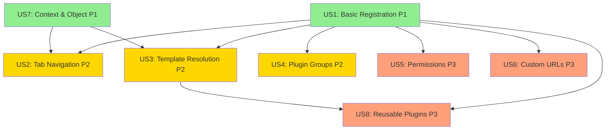

# Tasks: Plugin System for Model Extensibility

**Input**: Design documents from `/specs/008-plugin-system/`
**Prerequisites**: plan.md ✅, spec.md ✅, research.md ✅, data-model.md ✅, contracts/ ✅

**Organization**: Tasks are grouped by user story to enable independent implementation and testing of each story.

## Format: `[ID] [P?] [Story] Description`

- **[P]**: Can run in parallel (different files, no dependencies)
- **[Story]**: Which user story this task belongs to (e.g., US1, US2, US3)
- **File paths**: All paths are relative to repository root `c:\Users\jennings\Documents\repos\fairdm\`

---

## Phase 1: Setup (Shared Infrastructure)

**Purpose**: Project initialization and plugin system package structure

- [X] T001 Create plugin system package directory structure at `fairdm/contrib/plugins/`
- [X] T002 Create plugin system test directory structure at `tests/test_contrib/test_plugins/`
- [X] T003 [P] Create Cotton component directory at `fairdm/contrib/plugins/templates/cotton/plugin/`
- [X] T004 [P] Create plugin template directory at `fairdm/contrib/plugins/templates/plugins/`
- [X] T005 [P] Create contracts test fixtures directory at `tests/test_contrib/test_plugins/fixtures/`

---

## Phase 2: Foundational (Blocking Prerequisites)

**Purpose**: Core infrastructure that MUST be complete before ANY user story can be implemented

**⚠️ CRITICAL**: No user story work can begin until this phase is complete

- [X] T006 Implement Tab dataclass in `fairdm/contrib/plugins/menu.py`
- [X] T007 Implement visibility helper `is_instance_of()` in `fairdm/contrib/plugins/visibility.py`
- [X] T008 Implement PluginRegistry singleton class in `fairdm/contrib/plugins/registry.py`
- [X] T009 Implement `register()` method on PluginRegistry in `fairdm/contrib/plugins/registry.py`
- [X] T010 Implement Plugin mixin base class in `fairdm/contrib/plugins/base.py`
- [X] T011 Implement PluginGroup composition class in `fairdm/contrib/plugins/group.py`
- [X] T012 Implement utility functions (slugify, URL reversal) in `fairdm/contrib/plugins/utils.py`
- [X] T013 Create public API exports in `fairdm/contrib/plugins/__init__.py`
- [X] T014 Create re-export module at `fairdm/plugins.py` for `from fairdm import plugins` usage

**Checkpoint**: Foundation ready - user story implementation can now begin in parallel

---

## Phase 3: User Story 1 - Basic Plugin Registration and Display (Priority: P1) 🎯 MVP

**Goal**: Enable developers to create and register plugins that appear on model detail pages

**Independent Test**: Create a minimal plugin class, register it for Sample model, navigate to a Sample detail page, verify plugin content appears

### Implementation for User Story 1

- [X] T015 [P] [US1] Implement `Plugin.get_name()` classmethod in `fairdm/contrib/plugins/base.py`
- [X] T016 [P] [US1] Implement `Plugin.get_url_path()` classmethod in `fairdm/contrib/plugins/base.py`
- [X] T017 [US1] Implement `Plugin.get_urls()` classmethod in `fairdm/contrib/plugins/base.py`
- [X] T018 [US1] Implement `Plugin.get_object()` instance method in `fairdm/contrib/plugins/base.py`
- [X] T019 [US1] Implement `Plugin.get_context_data()` override in `fairdm/contrib/plugins/base.py`
- [X] T020 [US1] Implement `PluginRegistry.register()` method in `fairdm/contrib/plugins/registry.py`
- [X] T021 [US1] Implement `PluginRegistry.get_plugins_for_model()` method in `fairdm/contrib/plugins/registry.py`
- [X] T022 [US1] Implement `PluginRegistry.is_registered()` method in `fairdm/contrib/plugins/registry.py`
- [X] T023 [US1] Implement `PluginRegistry.get_urls_for_model()` method in `fairdm/contrib/plugins/registry.py`
- [X] T024 [US1] Create base plugin template at `fairdm/contrib/plugins/templates/plugins/base.html`
- [X] T025 [US1] Update model detail view URL patterns to include plugin URLs for Project model in `fairdm/core/project/urls.py`
- [X] T026 [US1] Update model detail view URL patterns to include plugin URLs for Dataset model in `fairdm/core/dataset/urls.py`
- [X] T027 [US1] Update model detail view URL patterns to include plugin URLs for Sample model in `fairdm/core/sample/urls.py`
- [X] T028 [US1] Update model detail view URL patterns to include plugin URLs for Measurement model in `fairdm/core/measurement/urls.py`
- [X] T029 [US1] Update model detail view URL patterns to include plugin URLs for Contributor model in `fairdm/contrib/contributors/urls.py`
- [X] T030 [US1] Implement Django system check E001 (missing required attributes) in `fairdm/contrib/plugins/checks.py`
- [X] T031 [US1] Implement Django system check E002 (duplicate plugin names) in `fairdm/contrib/plugins/checks.py`
- [X] T032 [US1] Implement Django system check E003 (URL path conflicts) in `fairdm/contrib/plugins/checks.py`
- [X] T033 [US1] Register system checks in `fairdm/contrib/plugins/apps.py`

**Checkpoint**: At this point, User Story 1 should be fully functional - developers can register plugins that render on detail pages

**Validation**: Run `poetry run python manage.py check` to verify system checks E001-E003 are implemented correctly

---

## Phase 4: User Story 7 - Automatic Context and Object Access (Priority: P1)

**Goal**: Plugins automatically receive model instance in context and generate breadcrumbs

**Independent Test**: Create a plugin that displays instance data via `{{ object }}`, verify breadcrumbs appear showing model hierarchy

**Note**: This is P1 priority alongside User Story 1 because context access is fundamental to useful plugins

### Implementation for User Story 7

- [X] T034 [P] [US7] Implement `Plugin.get_breadcrumbs()` method in `fairdm/contrib/plugins/base.py`
- [X] T035 [US7] Update `Plugin.get_context_data()` to include breadcrumbs in `fairdm/contrib/plugins/base.py`
- [X] T036 [US7] Update `Plugin.get_context_data()` to include `object` in template context in `fairdm/contrib/plugins/base.py`
- [X] T037 [US7] Update base template to render breadcrumbs in `fairdm/contrib/plugins/templates/plugins/base.html`
- [X] T038 [US7] Implement Django system check W001 (permission string validity) in `fairdm/contrib/plugins/checks.py`

**Checkpoint**: Plugins now have automatic access to model instances and breadcrumb navigation works

---

## Phase 5: User Story 2 - Tab-Based Navigation (Priority: P2)

**Goal**: Plugins with menu configuration appear as tabs on detail pages with proper ordering

**Independent Test**: Register multiple plugins with menu dicts for a model, verify tabs appear in correct order and navigate properly

### Implementation for User Story 2

- [X] T039 [P] [US2] Implement `PluginRegistry.get_tabs_for_model()` method in `fairdm/contrib/plugins/registry.py`
- [X] T040 [US2] Implement `` template tag in `fairdm/contrib/plugins/templatetags/plugin_tags.py`
- [X] T041 [US2] Create `<c-plugin-tabs />` Cotton component at `fairdm/contrib/plugins/templates/cotton/plugin/tabs.html`
- [X] T042 [US2] Create `<c-plugin-base />` Cotton component wrapper at `fairdm/contrib/plugins/templates/cotton/plugin/base.html`
- [X] T043 [US2] Update Project detail template to include plugin tabs in `fairdm/core/project/templates/project/project_detail.html`
- [X] T044 [US2] Update Dataset detail template to include plugin tabs in `fairdm/core/dataset/templates/dataset/dataset_detail.html`
- [X] T045 [US2] Update Sample detail template to include plugin tabs in `fairdm/core/sample/templates/sample/sample_detail.html`
- [X] T046 [US2] Update Measurement detail template to include plugin tabs in `fairdm/core/measurement/templates/measurement/measurement_detail.html`
- [X] T047 [US2] Update Contributor detail template to include plugin tabs in `fairdm/contrib/contributors/templates/contributor/contributor_detail.html`
- [X] T048 [US2] Update `Plugin.get_context_data()` to include tabs list and active tab detection in `fairdm/contrib/plugins/base.py`

**Checkpoint**: Plugins with menu configuration now appear as tabs with proper ordering and icons

**Note**: Template infrastructure (tags, components, includes) is complete. Portal developers can add tabs to detail templates using ``

---

## Phase 6: User Story 3 - Smart Template Resolution (Priority: P2)

**Goal**: Hierarchical template resolution allows model-specific customization

**Independent Test**: Create a plugin with default template, create model-specific override, verify correct template is used per model

### Implementation for User Story 3

- [X] T049 [US3] Implement `Plugin.get_template_names()` method with hierarchical resolution in `fairdm/contrib/plugins/base.py`
- [X] T050 [US3] Implement Django system check E004 (invalid template_name) in `fairdm/contrib/plugins/checks.py`
- [X] T051 [US3] Document template resolution hierarchy in `fairdm/contrib/plugins/base.py` docstring

**Checkpoint**: Template resolution now supports model-specific, parent-model, and fallback templates

---

## Phase 7: User Story 4 - Plugin Groups for Complex Workflows (Priority: P2) ✅

**Goal**: PluginGroup wraps multiple plugins under common URL namespace and single tab

**Independent Test**: Create multiple simple plugins, wrap in PluginGroup, verify shared URL prefix and single tab entry

### Implementation for User Story 4

- [X] T052 [P] [US4] Implement `PluginGroup.get_name()` classmethod in `fairdm/contrib/plugins/group.py`
- [X] T053 [P] [US4] Implement `PluginGroup.get_url_prefix()` classmethod in `fairdm/contrib/plugins/group.py`
- [X] T054 [US4] Implement `PluginGroup.get_urls()` classmethod in `fairdm/contrib/plugins/group.py`
- [X] T055 [US4] Implement `PluginGroup.get_default_plugin()` classmethod in `fairdm/contrib/plugins/group.py`
- [X] T056 [US4] Update `PluginRegistry.register()` to handle PluginGroup registration in `fairdm/contrib/plugins/registry.py`
- [X] T057 [US4] Update `PluginRegistry.get_tabs_for_model()` to render groups as single tab in `fairdm/contrib/plugins/registry.py`
- [X] T058 [US4] Implement Django system check E005 (empty plugins list in group) in `fairdm/contrib/plugins/checks.py`
- [X] T059 [US4] Implement Django system check E006 (invalid plugin class in group) in `fairdm/contrib/plugins/checks.py`
- [X] T060 [US4] Implement Django system check E007 (group URL prefix conflicts) in `fairdm/contrib/plugins/checks.py`

**Checkpoint**: PluginGroups can now wrap multiple plugins into cohesive features with shared namespacing

**Validation**: Run `poetry run python manage.py check` to verify all system checks E001-E007 pass ✓

---

## Phase 8: User Story 5 - Permission-Based Visibility (Priority: P3) ✅

**Goal**: Plugins respect permission requirements for both menu visibility and direct access

**Independent Test**: Create permission-gated plugin, verify unauthorized users don't see tab and get 403 on direct URL

### Implementation for User Story 5

- [X] T061 [P] [US5] Implement `Plugin.has_permission()` method with two-tier checking in `fairdm/contrib/plugins/base.py`
- [X] T062 [US5] Implement `Plugin.dispatch()` override with permission gating in `fairdm/contrib/plugins/base.py`
- [X] T063 [US5] Update `PluginRegistry.get_tabs_for_model()` to filter by permissions in `fairdm/contrib/plugins/registry.py`
- [X] T064 [US5] Implement `PluginGroup.has_permission()` method for group-level checking in `fairdm/contrib/plugins/group.py`
- [X] T065 [US5] Update system check W001 to validate permission strings exist in `fairdm/contrib/plugins/checks.py`

**Checkpoint**: Permission system now controls both tab visibility and direct URL access ✓

---

## Phase 9: User Story 6 - Custom URL Patterns (Priority: P3) ✅

**Goal**: Plugins can override default URL paths with custom values

**Independent Test**: Register plugin with custom url_path, verify URL matches custom path

### Implementation for User Story 6

- [X] T066 [US6] Update `Plugin.get_url_path()` to respect custom url_path attribute in `fairdm/contrib/plugins/base.py`
- [X] T067 [US6] Update system check E003 to detect custom URL path conflicts in `fairdm/contrib/plugins/checks.py`
- [X] T068 [US6] Implement Django system check W003 (invalid URL path characters) in `fairdm/contrib/plugins/checks.py`

**Checkpoint**: Plugins can now use custom URL paths instead of auto-generated defaults ✓

---

## Phase 10: User Story 8 - Reusable Plugin Components (Priority: P3) ✅

**Goal**: Plugin classes can be distributed in packages and inherited by portal developers

**Independent Test**: Create base plugin class in one package, inherit and register in another package, verify functionality

### Implementation for User Story 8

- [X] T069 [P] [US8] Create reusable base plugin classes in `fairdm/core/plugins.py` (Overview, Edit, Delete)
- [X] T070 [P] [US8] Document plugin inheritance patterns in `fairdm/contrib/plugins/base.py` docstring
- [X] T071 [US8] Create example reusable plugin in demo app at `fairdm_demo/plugins.py`

**Checkpoint**: Plugin inheritance and reusability patterns are documented and demonstrated ✓

---

## Phase 11: Migration from Old API

**Purpose**: Migrate existing plugins to new API

**⚠️ NOTE**: This phase updates all existing plugin registrations to use the new API

- [X] T072 [P] Migrate Project plugins to new API in `fairdm/core/project/plugins.py`
- [X] T073 [P] Migrate Dataset plugins to new API in `fairdm/core/dataset/plugins.py`
- [X] T074 [P] Migrate Sample plugins to new API in `fairdm/core/sample/plugins.py`
- [X] T075 [P] Migrate Measurement plugins to new API in `fairdm/core/measurement/plugins.py`
- [X] T076 [P] Migrate Contributor plugins to new API in `fairdm/contrib/contributors/plugins.py`
- [X] T077 [P] Migrate Activity Stream plugin to new API in `fairdm/contrib/activity_stream/plugins.py`
- [X] T078 [P] Migrate Generic plugins (Keywords, Descriptions, KeyDates) to new API in `fairdm/contrib/generic/plugins.py`
- [X] T079 [P] Migrate Collections plugin (DataTable) to new API in `fairdm/contrib/collections/plugins.py`
- [X] T080 [P] Update demo app plugins to new API in `fairdm_demo/plugins.py`
- [X] T081 Remove old plugin system files: `fairdm/contrib/plugins/config.py`
- [X] T082 Remove old plugin system files: `fairdm/contrib/plugins/views.py`
- [X] T083 Remove old plugin system files: `fairdm/contrib/plugins/plugin.py`

**Checkpoint**: All existing plugins migrated to new API, old code removed

**Validation**: Run `poetry run python manage.py check` to verify all migrations work correctly with new API

---

## Phase 12: Polish & Cross-Cutting Concerns

**Purpose**: Documentation, error messages, and quality improvements

- [X] T084 [P] Add comprehensive docstrings to all public APIs in `fairdm/contrib/plugins/`
- [X] T085 [P] Document Django Media class usage for plugin static assets in `fairdm/contrib/plugins/base.py` docstring with example
- [X] T086 [P] Create developer quickstart examples in `specs/008-plugin-system/quickstart.md` (already complete)
- [X] T087 [P] Update framework documentation for plugin system in `docs/portal-development/plugins.md`
- [X] T088 [P] Add plugin system section to demo app documentation in `fairdm_demo/README.md`
- [X] T089 Run Django system checks: `poetry run python manage.py check` and verify exit code 0 with zero errors reported
- [X] T090 Verify all migrations are up to date: `poetry run python manage.py makemigrations --check`
- [X] T091 Manual testing: Create sample plugin in demo app and verify all user stories work
- [X] T092 Validate critical edge cases: duplicate plugin registration, URL conflicts, missing models, circular template dependencies, invalid permissions
- [X] T093 Update CHANGELOG.md with breaking changes and migration guide

**Checkpoint**: Plugin system is production-ready with complete documentation

---

## Dependencies Between User Stories

**Key Dependencies**:
- US1 (Basic Registration) and US7 (Context/Object) are foundational (P1) and must complete first
- US2-US4 (P2 features) depend on US1+US7 being complete
- US5, US6, US8 (P3 features) can be built after US1

**Parallel Execution Opportunities**:
- After Foundation phase: US1 and US7 can be developed in parallel (different methods)
- After US1+US7: US2, US3, US4 can be developed in parallel (different features)
- After US1: US5, US6, US8 can be developed in parallel (different concerns)
- Within Migration phase: All plugin file migrations can run in parallel

---

## Implementation Strategy

### MVP Scope (Recommended First Iteration)
Focus on **User Story 1 (Basic Registration)** + **User Story 7 (Context/Object)** only:
- Tasks: T001-T038 (Foundation + US1 + US7)
- Delivers: Working plugin system with registration, rendering, context, breadcrumbs
- Value: Developers can extend models declaratively without framework modification
- Time estimate: 1-2 days
- Validation: Create minimal plugin in demo app, verify it appears on detail page with breadcrumbs

### Incremental Delivery Plan
1. **MVP** (T001-T038): Basic registration + context → Deploy and gather feedback
2. **Enhanced UX** (T039-T051): Add tabs + template resolution → Deploy
3. **Complex Features** (T052-T060): Add PluginGroups → Deploy
4. **Enterprise Features** (T061-T068): Add permissions + custom URLs → Deploy
5. **Ecosystem** (T069-T071): Add reusable components → Deploy
6. **Migration** (T072-T083): Migrate existing plugins → Deploy
7. **Polish** (T084-T093): Documentation and final QA → Release

### Task Count Summary
- **Total Tasks**: 93
- **Setup**: 5 tasks (T001-T005)
- **Foundation**: 9 tasks (T006-T014)
- **User Story 1 (P1)**: 19 tasks (T015-T033)
- **User Story 7 (P1)**: 5 tasks (T034-T038)
- **User Story 2 (P2)**: 10 tasks (T039-T048)
- **User Story 3 (P2)**: 3 tasks (T049-T051)
- **User Story 4 (P2)**: 9 tasks (T052-T060)
- **User Story 5 (P3)**: 5 tasks (T061-T065)
- **User Story 6 (P3)**: 3 tasks (T066-T068)
- **User Story 8 (P3)**: 3 tasks (T069-T071)
- **Migration**: 12 tasks (T072-T083)
- **Polish**: 10 tasks (T084-T093)

### Parallel Execution Examples

**Foundation Phase**: Most tasks are sequential due to dependencies, but T003 and T004 (template directories) can run in parallel.

**User Story 1 Phase**: 
- Parallel batch 1: T015, T016 (different classmethods)
- Parallel batch 2: T025-T029 (different model URL files)
- Parallel batch 3: T030-T032 (different system checks)

**User Story 2 Phase**:
- Parallel batch: T043-T047 (different model template files)

**Migration Phase**:
- Parallel batch: T072-T080 (all plugin migrations - different files)

---

## Validation Checklist

After completing all phases, verify:

- [X] All Django system checks pass (E001-E007, W001-W002)
- [X] Plugins can be registered for all base models (Project, Dataset, Sample, Measurement, Contributor)
- [X] Plugins with `menu` dict appear as tabs
- [X] Plugins with `menu = None` are accessible via direct URL only
- [X] Tab ordering respects `menu["order"]` values
- [X] Template resolution follows documented hierarchy
- [X] Breadcrumbs appear correctly on all plugin pages
- [X] Model instance is available in plugin context as `object`
- [X] PluginGroups create single tab with shared URL namespace
- [X] Permission-gated plugins respect authorization
- [X] Unauthorized users get 403 on protected plugin URLs
- [X] Custom `url_path` attributes work correctly
- [X] Visibility `check` filters work (e.g., `is_instance_of(RockSample)`)
- [X] Edge cases validated: duplicate registration, URL conflicts, missing models, circular template dependencies, invalid permission strings
- [X] All existing plugins migrated to new API
- [X] Old plugin system code removed
- [X] Demo app demonstrates plugin patterns
- [X] Documentation is complete and accurate
